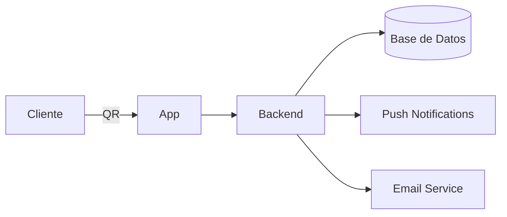

#  Quebrada del Vino - 2026
### TFI Proyecto Grupal - TUP - UTNFRA


---

## Descripción

Este repositorio tiene la aplicación mobile, front-end y back-end para el restaurante 'Quebrada del Vino'

---

## 📚 Índice

- [Descripción](#descripción)
- [Autores](#autores)
- [Módulos](#testing)
- [Tareas](#tareas)
- [Branches](#branches)
- [Arquitectura](#️🏗️-arquitectura)
- [Stack Tecnológico](#🧩-stack-tecnológico)
- [Instalación](#️instalación)


---

## Autores

 [@cosalamone](https://github.com/cosalamone) 

 [@SMNoah](https://github.com/SMNoah) 

 [@Minipomy](https://github.com/Minipomy)

---

## Módulos
- [ ] Autenticación y usuarios
  - [ ] Sub-task 1
- [ ] Gestion Clientes
  - [ ] Sub-task 1
- [ ] Gestion Empleados
  - [ ] Sub-task 1
- [ ] Menu Productos
  - [ ] Sub-task 1
- [ ] Gestion Mesas y Salon
  - [ ] Sub-task 1
- [ ] Gestion Pedidos
  - [ ] Sub-task 1
- [ ] Comunicacion (interna/externa)
  - [ ] Sub-task 1
- [ ] Juegos
  - [ ] Sub-task 1
- [ ] Encuestas y Estadisticas
  - [ ] Sub-task 1
- [ ] Pagos
  - [ ] Sub-task 1

---

## Tareas
- Creacion de proyecto (07/04/2026) - 

- Diseño de ícono de la aplicacion (07/04/2026) - 

---

## Branches
- Main

---

## 🏗️ Arquitectura


---

## 🧩 Stack Tecnológico
### 🎨 Client

> 
>
> 🎛️ **PrimeNG**
>
> 
>
> 
>
> 🧪 **Zod**


### ⚙️ Server

> 
>
> 
>
> 🔐 **SSO (Auth Providers)**

---

## Instalación

Clone the project

```bash
  git clone https://github.com/SMNoah/quebrada-del-vino-2026.git
```

Go to the project directory

```bash
  cd quebrada-del-vino-2026
```

Install dependencies

```bash
  npm install 
```

Start the server

```bash
  npm run start
```

---
